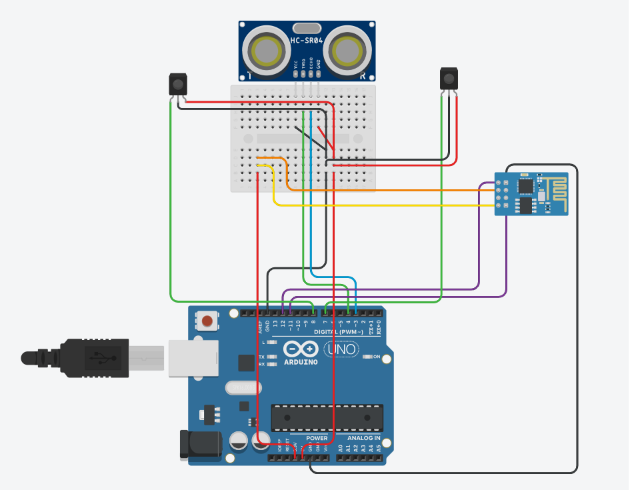

# Floor Cleaning Robot
Cleaning your floor has never been easier! This floor-cleaning robot works autonomously by avoiding nearby obstacles using ultrasonic and infrared sensors. The brush attached to its underside sweeps up any debris it encounters while moving. 


| **Engineer** | **School** | **Area of Interest** | **Grade** |
|:--:|:--:|:--:|:--:|
| Angela C. | Diamond Bar High School | Biosystems Engineering | Incoming Junior

**Replace the BlueStamp logo below with an image of yourself and your completed project. Follow the guide [here](https://tomcam.github.io/least-github-pages/adding-images-github-pages-site.html) if you need help.**


# Final Milestone

<iframe width="560" height="315" src="https://www.youtube.com/embed/F7M7imOVGug" title="YouTube video player" frameborder="0" allow="accelerometer; autoplay; clipboard-write; encrypted-media; gyroscope; picture-in-picture; web-share" allowfullscreen></iframe>

My final milestone and personal modification focused on developing a mobile app to wirelessly control the robot. I added an ESP8266 Wi-Fi module into my project, which is a low-cost microchip that allows an Arduino to connect to a local network. Once the ESP8266 establishes a connection to my home Wi-Fi router, the Arduino can communicate with it using RX and TX pins. I started a server on port 80 in order to host a local web page, which will receive HTTP requests from an external device (in this case my phone). My code is able to parse these requests and turn the robot on or off in real time. If I had more time to modify my project, I would add a manual driving mode where the user can control the robot with a joystick.

In summary, while building this project, I gained experience with IoT communication and how to configure an ESP8266 module using serial commands. My biggest challenge and subsequently my biggest accomplishment was definitely getting the ESP module to work and connect to the Wi-Fi because I didn’t even know that it was possible prior to this program. In the future, I plan on learning about app design and hardware communication in greater detail.


# Second Milestone

<iframe width="560" height="315" src="https://www.youtube.com/embed/lzNUG7Wf0jk" title="Angela C. Milestone 2" frameborder="0" allow="accelerometer; autoplay; clipboard-write; encrypted-media; gyroscope; picture-in-picture; web-share" referrerpolicy="strict-origin-when-cross-origin" allowfullscreen></iframe>

My second milestone was completing the coding portion of my project. The robot drives forward autonomously until it detects an obstacle, where it then redirects its path elsewhere. My code works by sending out a 10-microsecond pulse through the ultrasonic sensor, then measuring the time it takes to return. This measurement is used to calculate the distance in centimeters to an obstruction in front of it. The IR sensors work in a similar way, monitoring the sides of the robot for obstacles and moving away accordingly. The base project has been completed; I only need to work on my final milestone now. My modification will feature an app that turns the robot on/off remotely.


# First Milestone

<iframe width="560" height="315" src="https://www.youtube.com/embed/IzxStotfcVk" title="Angela C. Milestone 1" frameborder="0" allow="accelerometer; autoplay; clipboard-write; encrypted-media; gyroscope; picture-in-picture; web-share" referrerpolicy="strict-origin-when-cross-origin" allowfullscreen></iframe>

My first milestone was finishing the hardware portion of my base project. This was relatively simple, as the floor cleaning robot is essentially a standard 3-in-1 starter kit robot. The chassis of this bot is made from an acrylic board, two TT wheels, and one universal wheel. Attached to it is an Arduino Uno R3 board acting as the "brain" of the bot, controlling the TT motors. The ultrasonic sensor emits sound pulses to measure the distance to an object in front of it, while the IR sensors sense any obstructions to the right and left of the robot. My only issue was that the wheels occasionally dragged when turning, but I chalked it up to the them getting caught on the acrylic board.

# Schematics 


# Bill of Materials

| **Part** | **Note** | **Price** | **Link** |
|:--:|:--:|:--:|:--:|
| 3 in 1 Starter Kit | All components of the robot can be found within the starter kit, including the chassis. | $69.99 | <a href="https://www.sunfounder.com/products/sunfounder-3-in-1-iot-smart-car-learning-ultimate-starter-kit"> Link </a> |
| Odistar Desktop Vacuum Cleaner | For cleaning the floor | $12.98 | <a href="https://www.amazon.com/ODISTAR-Endurance-Cordless-Rotatable-Keyboard/dp/B07Q128V6W/ref=sr_1_1_sspa?crid=GTU49YHVDQWH&dib=eyJ2IjoiMSJ9.7-jDIbAMj99apdM_o_tLpsiMU6__WeFo0jVnuZp4HXX5tHOHRXb66kw-HGzvDadVS5x0-_yRjqsAvIwupdlePsQBvta8EnoEUn-bV8riLfrQDSmc8oA7QwR0_bv7PFhzW9HCeLLtlY2HeyKwOcJYCkptrZhRWCsIRB6hi3mIM8mELFfRgPnJnAAojT23QOLDN_ojzKNDCWpzrbnlPaHWyCVKXGk6DI1i-PdmSrluJlg.5YwF74G0MfllQsEfLe-Ntj9BZGB_MJ5HbVqeb2vmbzI&dib_tag=se&keywords=odistar%2Bdesk%2Bvacuum&qid=1781204100&sprefix=odistar%2Bdesk%2B%2Caps%2C160&sr=8-1-spons&sp_csd=d2lkZ2V0TmFtZT1zcF9hdGY&th=1"> Link </a> |

# Code
```c++
#include <SoftwareSerial.h>

SoftwareSerial ESP8266(12, 11); //(RX, TX)

bool connected = false;
int connection_attempts = 0;
bool isCleaning = false;

const int A_1B = 5;
const int A_1A = 6;
const int B_1B = 9;
const int B_1A = 10;

const int echoPin = 4;
const int trigPin = 3;

const int rightIR = 7; 
const int leftIR = 8; 

void printESPResponse(int waitTime);

void setup() {
  Serial.begin(9600); 
  ESP8266.begin(9600);  
  delay(1000);

  pinMode(A_1B, OUTPUT); 
  pinMode(A_1A, OUTPUT);
  pinMode(B_1B, OUTPUT); 
  pinMode(B_1A, OUTPUT);

  pinMode(echoPin, INPUT); 
  pinMode(trigPin, OUTPUT);

  pinMode(leftIR, INPUT); 
  pinMode(rightIR, INPUT);

  Serial.println("Resetting ESP8266 module...");
  ESP8266.println("AT+RST");
  delay(4000);
  while(ESP8266.available()) ESP8266.read();

  Serial.println("Setting station mode");
  ESP8266.println("AT+CWMODE=1");
  printESPResponse(2000);

  Serial.println("Connecting to wifi...");
  // ESP8266.println("AT+CWJAP=\"<wifi>\",\"<pass>\""); <-- replace w/ wifi & password
  
  printESPResponse(8000); 

  Serial.println("\nSetting MUX");
  ESP8266.println("AT+CIPMUX=1"); 
  printESPResponse(2000);
  
  Serial.println("Starting server on port 80");
  ESP8266.println("AT+CIPSERVER=1,80"); 
  printESPResponse(2000);
  
  Serial.println("Getting IP address");
  ESP8266.println("AT+CIFSR"); 
  printESPResponse(2000);

  Serial.println("\nSetup completed");
  connected = true;
}

void loop() {
  if (ESP8266.available()) {
    String incoming = "";
    unsigned long timeout = millis();
    
    while (millis() - timeout < 150) { 
      if (ESP8266.available()) {
        incoming += (char)ESP8266.read();
      }
    }

    if (incoming.indexOf("+IPD,") != -1) {
      Serial.println("\nReceived Request!");
      int ipdIndex = incoming.indexOf("+IPD,");
      char connectionId = incoming.charAt(ipdIndex + 5); 
      
      if (incoming.indexOf("GET /on") != -1) {
        isCleaning = true;
        Serial.println("--Starting--");
      }
      else if (incoming.indexOf("GET /off") != -1) {
        isCleaning = false;
        stopMove();
        Serial.println("--Stopping--");
      }
      
      delay(100); 
      ESP8266.print("AT+CIPCLOSE=");
      ESP8266.println(connectionId);
      printESPResponse(500);
    }
  }

  if (isCleaning) {
    selfDriving(); 
  } else {
    stopMove(); 
  }
}

void printESPResponse(int waitTime) {
  unsigned long startTime = millis();
  while (millis() - startTime < waitTime) {
    while (ESP8266.available()) {
      char c = ESP8266.read();
      Serial.print(c);
    }
  }
}

void selfDriving() {
  int left = digitalRead(leftIR);  
  int right = digitalRead(rightIR);

  if (!left && right) {
    backLeft(120);
    } else if (left && !right) {
      backRight(120);
    } else if (!left && !right) {
      moveBackward(120);
    } else {
      float distance = readSensorData();
      Serial.println(distance);
      if (distance > 50) {
        moveForward(120);
      } else if (distance < 5 && distance > 2) {
        moveBackward(120);
        delay(1000);
        backLeft(120);
        delay(500);
      } else {
      moveForward(120);
    }
  }
}

float readSensorData() { 
  digitalWrite(trigPin, LOW);
  delayMicroseconds(2);
  digitalWrite(trigPin, HIGH);
  delayMicroseconds(10);
  digitalWrite(trigPin, LOW);
  float distance = pulseIn(echoPin, HIGH) / 58.00;
  return distance;  
}

void moveForward(int speed) { 
  analogWrite(A_1B, 0); 
  analogWrite(A_1A, speed); 
  analogWrite(B_1B, speed); 
  analogWrite(B_1A, 0); 
  }

void moveBackward(int speed) { 
  analogWrite(A_1B, speed); 
  analogWrite(A_1A, 0); 
  analogWrite(B_1B, 0); 
  analogWrite(B_1A, speed); 
  }

void backLeft(int speed) { 
  analogWrite(A_1B, speed); 
  analogWrite(A_1A, 0); 
  analogWrite(B_1B, 0); 
  analogWrite(B_1A, 0); 
  }

void backRight(int speed) { 
  analogWrite(A_1B, 0); 
  analogWrite(A_1A, 0); 
  analogWrite(B_1B, 0); 
  analogWrite(B_1A, speed); 
  }

void stopMove() { 
  analogWrite(A_1B, 0); 
  analogWrite(A_1A, 0); 
  analogWrite(B_1B, 0); 
  analogWrite(B_1A, 0); 
}
```

# Other Resources
[SunFounder Kit Assembly Tutorial](https://docs.sunfounder.com/projects/3in1-kit-v2/en/latest/car_project/car_project.html)
[Connect ESP8266 to Arduino Uno](https://youtu.be/igPqNlfLcs0)
